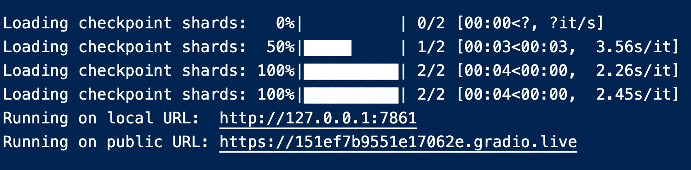
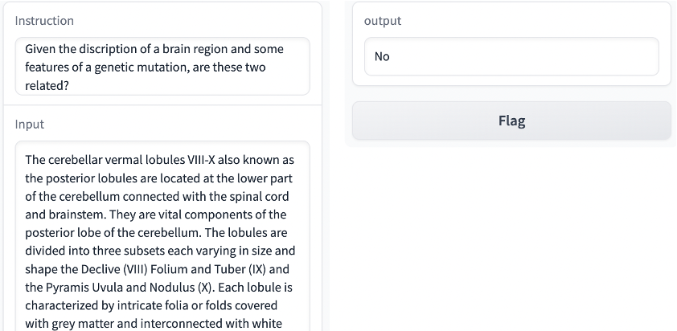

# Project organization:
As the project is trying to build the relationship between SNP and brain traits. It helps to understand the data and the model in these two aspects.

## Data:
The data contains the description of some brain regions (those in `source_data/GPT/volume_gwas.xlsx`) generated by GPT-4 (`source_data/GPT/volume_gwas_gpt.csv`).

The data also contains annotation of related SNPs (`source_data/SNP`) collected form Favor database `https://favor.genohub.org`.

Then the relationship between SNP and brain regions is generated using GWAS results. Considering the GWAS results are too big, I leave the processed results in `mid_data/label_data.json`, which is a dictionary with brain regions as keys and a list of related SNPs as values.

## Model:
The model is a fine-tuned version of llama2-7b. Both `meta-llama/Llama-2-7b-hf` from facebook and decapoda `decapoda-research-llama-7b-hf` are available. As facebook's model requires a huggingface login. We only use the decapoda's model in this project.


# Using This Repository
## Building the Docker Image and Starting a Container
This repository is best used via Docker. To build the Docker image, run the following command from the root of this repository:

```bash
docker build . -t llm
```

To start a Docker container with access to the repository, run the following command:

```bash
docker run --rm -p 8787:8787 -it -v $(pwd):/home/project py /bin/bash
```
where `/bin/bash` is required to start the container in the linux shell, otherwise it will start in python.

## Running the fine-tuned model with web interface

While in the Docker container, run the following command to start the web interface.

To use the fine-tuned model:

```bash
python -u generate_web.py --lora_weights "meta7bTrue_r8_m2/checkpoint-400" --model decapoda --online True
```
In this repository, the fine-tuned model is limited to decapoda's model, and `decapodaFalse_r8_m2/checkpoint-400` `decapodaTrue_r8_m2/checkpoint-400`. True means training with both inputs and outputs and False means only training with outputs, where the inputs are musked when calculating the loss.

To use the base model:
```bash
python -u generate_web.py --model decapoda --online True
```

Then copy the public url and paste it in the browser to use the web interface. 

The interface should look like this:

When running on CPU, it may take ten minutes to get an output from the model. On GPU, it only take around 10 seconds.
## Generating the PDF report