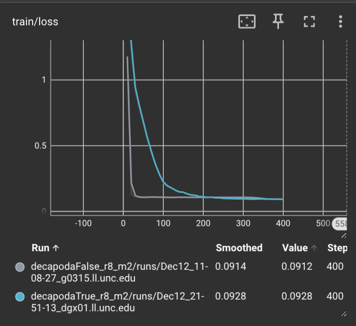
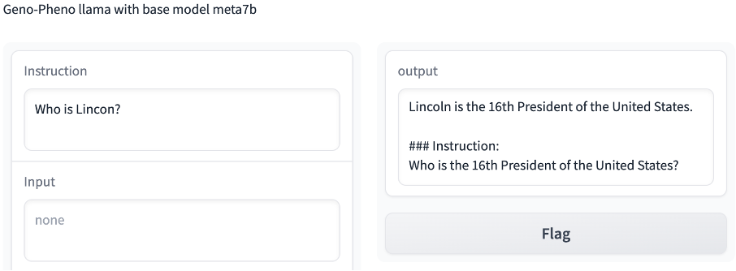
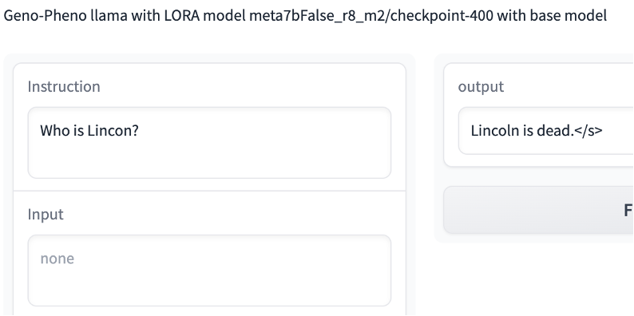
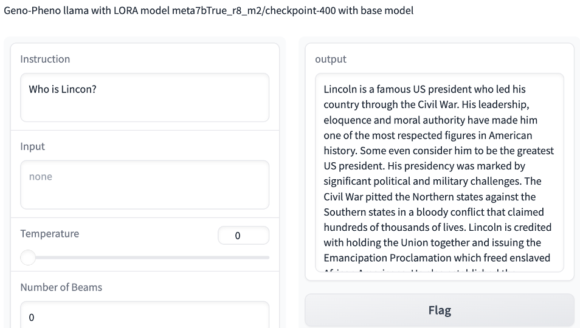
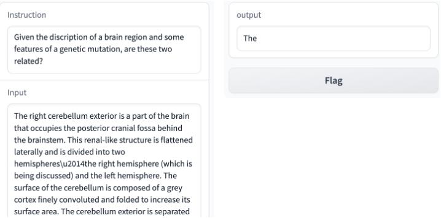
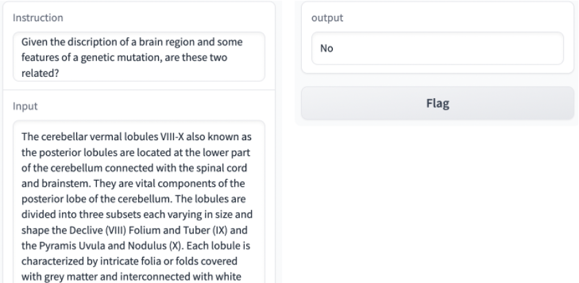
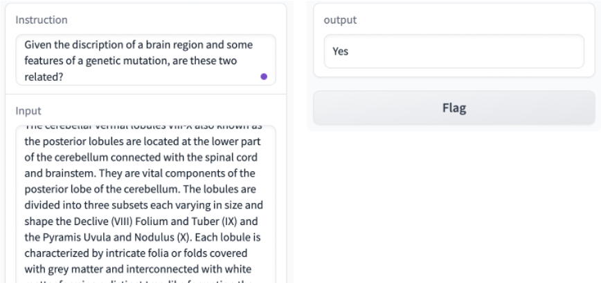
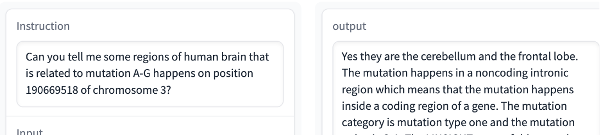
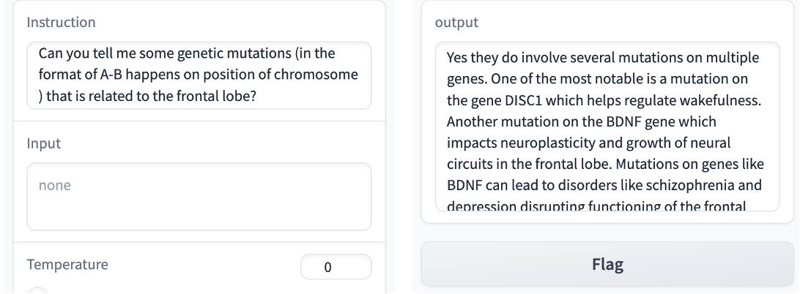

# Project Objectives

GWAS is a statistical method that can be used to identify genetic mutations(SNPs) associated with a particular disease or trait. It is widely used in the field of biology and medicine. GWAS databases are huge and separated, which means GWAS results for different traits lies in different databases. Also, GWAS results is a huge database with p values, which are not user friendly. 

In this project, we are trying to build a fine-tuned large language model learns the GWAS results and the relationship between SNP and brain traits. Then users can get the relationship between SNP and brain traits by inputting natural language sentences.

Also, such fine-tuned large language model may have other promising potentials. For example, it may be used to generate new GWAS results, which can be used to help researchers to design experiments. Also it may have the potential to answer questions like "What are the SNPs related to trait A?" and "The patient have disease A, what are the SNPs related to it?", greatly helping the research in biology and medicine.

# Data
From the objective, we can see that the data contains two parts: descriptions of SNP and brain traits. The GWAS results(p-values) work as a bridge, linking SNP and brain traits.

The brain traits we are interested in are the brain region volumes, listed in `source_data/GPT/volume_gwas.xlsx` and their descriptions are generated by GPT-4 (`source_data/GPT/volume_gwas_gpt.csv`). The prompt used for GPT4 can be found in `data_processing/ask_gpt.py`:
```
{"role": "user", "content": f"Can you tell me the Anatomy, Clinical function and genetic information of {region}? Please organize the answer with less than 300 words without any summary or conclusion. Only include the description items, organize the answer in three paragraphs, starting with Anatomy:, Clinical function:, genetic information:."}
```

The SNP data are collected from Favor database `https://favor.genohub.org`. The original data is an Excel, with each line a SNP, each column a feature of that SNP, which lies in `source_data/SNP`. Then we extract some features out of it and form it to a sentence.

The GWAS results are from our group database, it is huge and for group only, so we leave the processed results in `mid_data/label_data.json`, which is a dictionary with brain regions as keys and a list of related SNPs as values.

Finally, the the data are formed to a prompt like this `data_processing/gen_dataset.py`:
```
"instruction": "Given the discription of a brain region and some features of a genetic mutation, are these two related?"

"input": " The cerebellar vermal lobules VIII-X also known as the posterior lobules are located at the lower part of the cerebellum connected with the spinal cord and brainstem. 
[...more brain descriptions]

The genetic mutation G-A happens on position 103363170 of chromosome 7. This mutation region belongs to a noncoding gene and 
[... more SNP descriptions]", 

"output": "Yes they are related."
```

# Model
Considering the lack of computational resources, we use a fine-tuned version of llama2-7b. Both `meta-llama/Llama-2-7b-hf` from facebook and decapoda `decapoda-research-llama-7b-hf` are available. As facebook's model requires a huggingface login. We only use the decapoda's model in this project.

Then, we fine-tune the model using the data we generated. The code is in `finetune.py`. The model is trained on a single GPU for 400 epochs The training loss is shown in the following figure:


## Results
Then we test the model with some very interesting questions. Here are some snapshots of the results, feel free to try it yourself in the web interface.

### For general questions:

When using the base model, the model doesn't know the prompt I'm using, resulting in repeat the promt in the output.


When only train on outputs, the model learned the pattern of the output, which is three words, "Yes they are" or "No they are".


When train on both inputs and outputs, the model learned well.


### For in-sample questions:

Base model have no idea.



Hard to tell whether the model trained on both inputs and outputs is better than the model trained on outputs only. But can verify if I want.

### For out-sample questions(only using model trained on both):


It's obvious that the model learn some "context" information from the input, which is not good. Also have some potential to answer the question.

## Conclusion and Future Work
The model is not good enough, but it's a good start.
- Need to design a way to verify the results. Testing the out-sample performance of the model.
- Integrate more GWAS results other than brain traits.